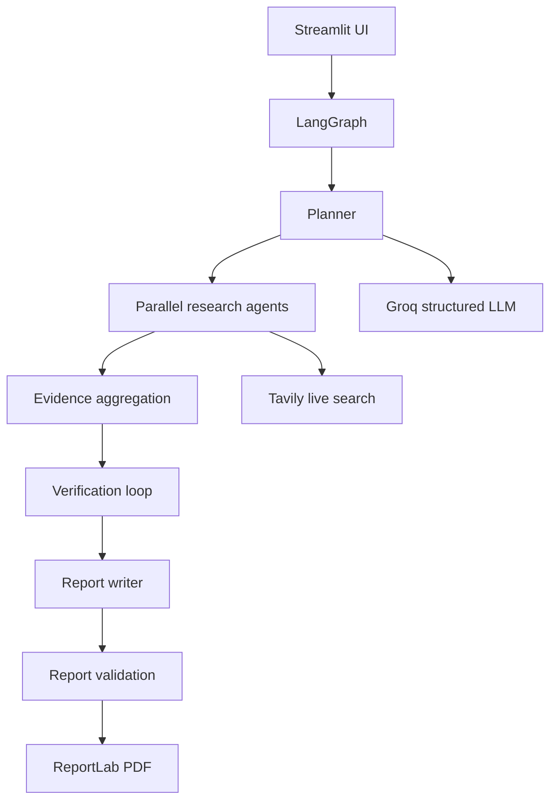

# Automated Market Research Agent

A browser-based Streamlit application that turns an arbitrary company, multi-company, industry, or market question into a source-backed Markdown and PDF report.

## Architecture



The planner and agents use Groq when live mode is enabled. Tavily supplies live search results, which are normalized into validated Pydantic `Source` objects. LangGraph owns state and routing, including bounded targeted re-search when claims are unsupported. ReportLab renders the final report with headers, footers, page numbers, and automatic breaks.

## Features

- Dynamic research planning for companies, comparisons, industries, and markets.
- Company, competitor, financial, market, and news research stages.
- URL deduplication, source preservation, explicit uncertainty, and claim verification.
- Bounded verification retry loop.
- Streamlit tabs for summary, report, financials, competitors, sources, and raw research data.
- Markdown, PDF, research JSON, and sources JSON downloads.
- Mock mode for UI and test runs without API keys.

## Installation and running

```powershell
python -m venv .venv
.venv\Scripts\activate
pip install -r requirements.txt
Copy-Item .env.example .env
streamlit run app.py
```

## Access from other computers

The app is configured to listen on all network interfaces. For computers on the same Wi-Fi or LAN, start it with:

```powershell
streamlit run app.py --server.address=0.0.0.0 --server.port=8501
```

Then find the host computer's local IP address with `ipconfig` and open this URL from another computer:

```text
http://<host-computer-ip>:8501
```

For example: `http://192.168.1.25:8501`. Allow Python or TCP port `8501` through the host computer's firewall when Windows prompts. Do not expose this development setup directly to the public internet without authentication and HTTPS.

The included `run-network.ps1` script starts the same configuration.

## Public hosting

For a public URL, deploy the repository to a hosting service that supports Python and Streamlit. Streamlit Community Cloud is the simplest option:

1. Push this project to a private or public GitHub repository.
2. Create an app at `share.streamlit.io` and select the repository, branch, and `app.py`.
3. Add `GROQ_API_KEY`, `GROQ_MODEL`, and `TAVILY_API_KEY` as deployment secrets.
4. Leave `.env` out of GitHub. The app reads secrets from the hosting environment.

The project also includes a `Dockerfile` for Docker-compatible hosting:

```powershell
docker build -t market-research-agent .
docker run --env-file .env -p 8501:8501 market-research-agent
```

For production internet deployments, put the container behind HTTPS, restrict access with authentication or an identity-aware proxy, and use a secret manager for API keys. The application does not require any hard-coded host name or local-only URL.

Set `GROQ_API_KEY`, `GROQ_MODEL`, and `TAVILY_API_KEY` in `.env` for live research. The example uses Groq's current `openai/gpt-oss-120b` model; choose a model enabled for your Groq project if availability differs. For local testing, set `MOCK_MODE=true`; mock sources are intentionally labeled and no financial numbers are fabricated.

## Testing

```powershell
pytest
```

Example queries include `Research Tesla and its major competitors`, `Compare Apple, Microsoft and Google`, `Analyze the global electric vehicle industry`, `Research the semiconductor market`, and `Analyze the cybersecurity industry`. Outputs are written to `output/` and can also be downloaded from the UI.

## Limitations and future improvements

Live extraction of numeric financial metrics should be strengthened with filing-specific parsers and a durable source database. Future work can add authentication, scheduled research, richer PDF tables/charts, persistent report history, and stricter per-claim LLM verification.
